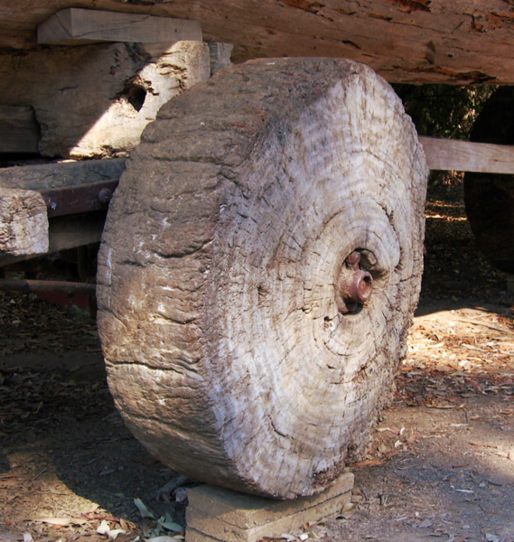
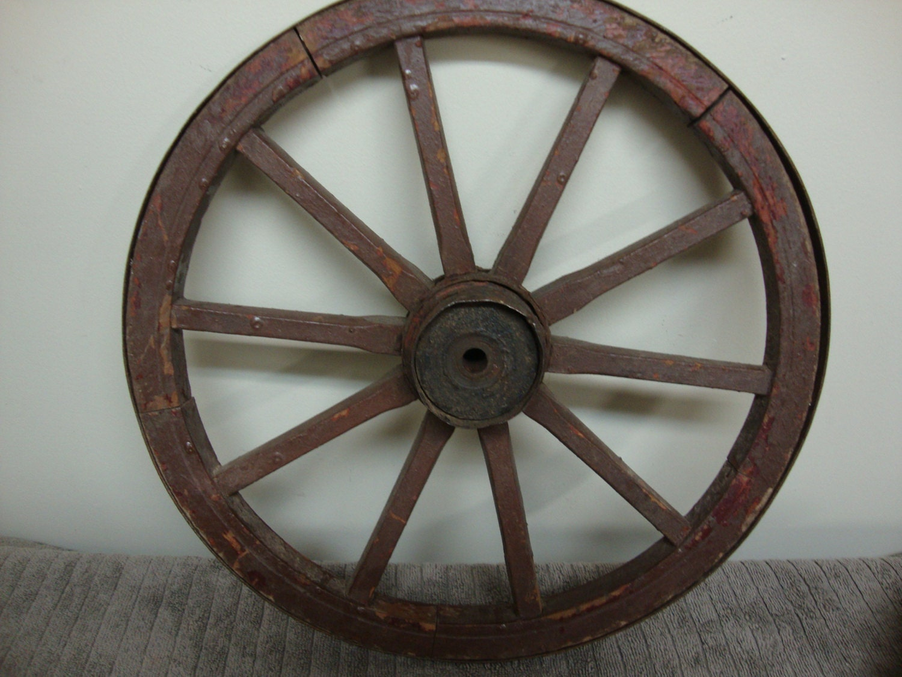
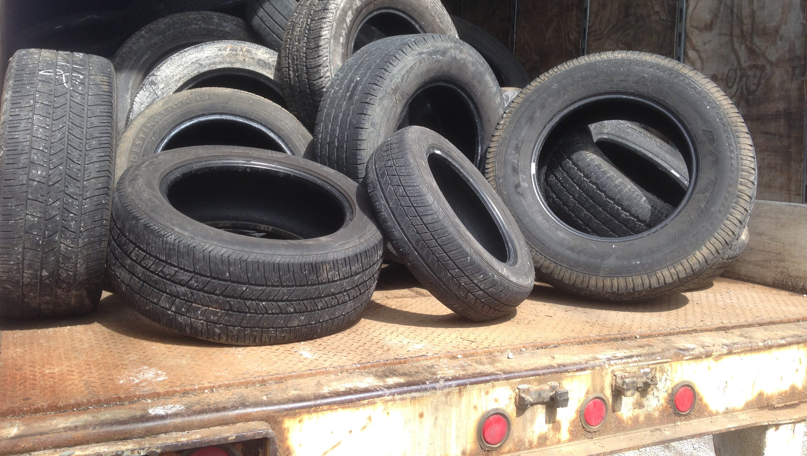
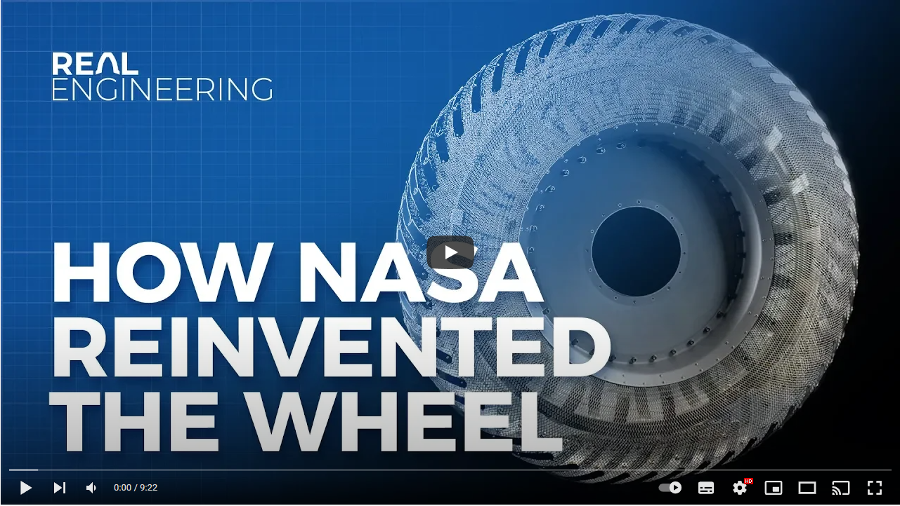
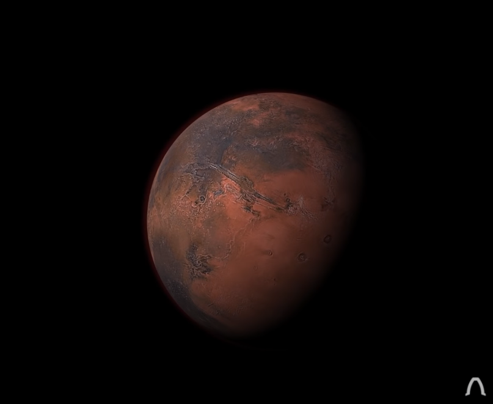
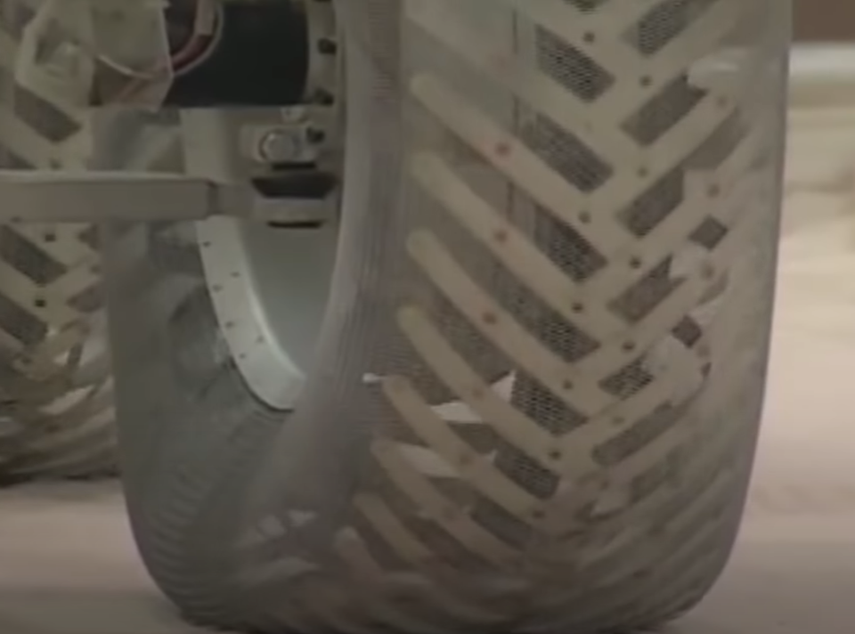
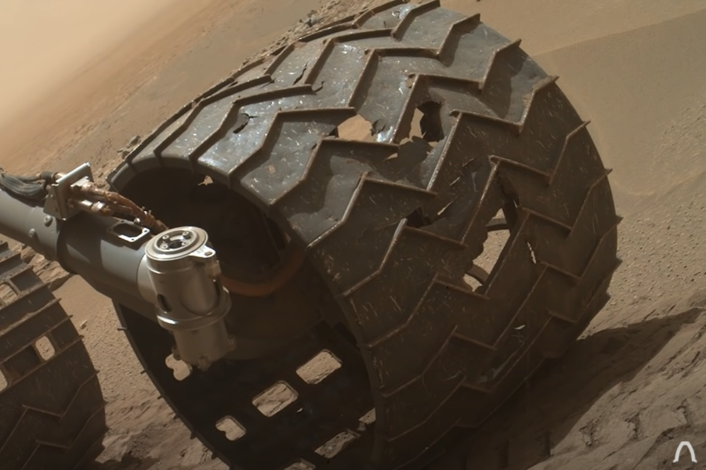
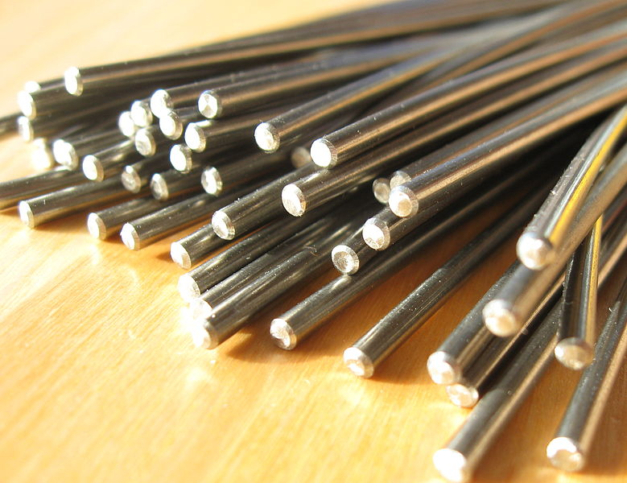
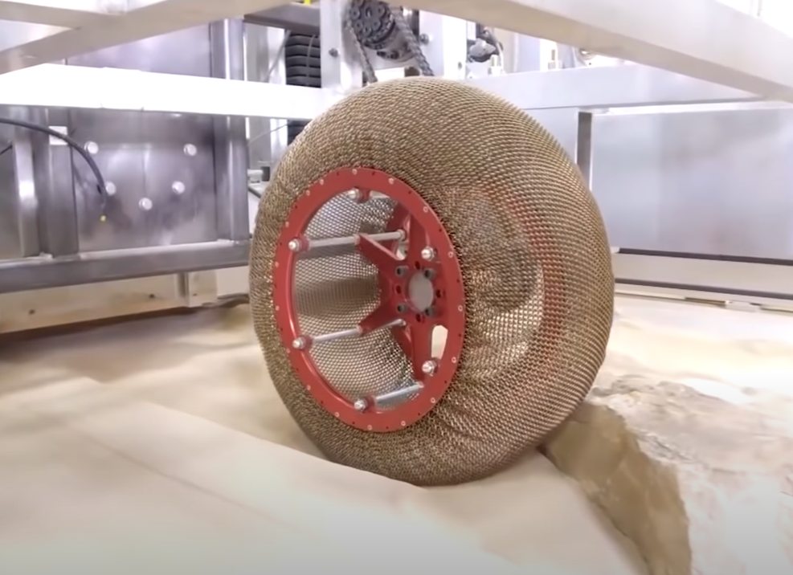

<!--
_header: ""
_footer: ""
_paginate: false
_class: "centerer"
-->

# The wheel

Antoine Willerval

<!-- 1 - Intro 1min? -->

---

> A wheel is a circular component that is intended to rotate on an axle bearing.

_Wikipedia_

<!-- 2 - Wikipedia 2min? -->

---

## Wooden wheel

$>2200$ BC.

<!-- 3 - Wooden wheel 3min? -->

---

## Spoked wheel

$1500$ BC.

<!-- 4 - Spoked wheel 4min? -->

---

## Pneumatic tire

$1845$ - now.

<!-- 4 - Spoked wheel 5min? -->

---

<!-- 5 - Youtube video 5min30. -->

---

## Why a new wheel is important?

$-130$°C, UV Radiation.

<!-- 6 - Rubber will die - 6min. -->

---

## First idea, aluminium wheel

<!-- 7 - Aluminium wheel, moon and first mars missions - 7min. -->

---

## Why a new wheel is important?

Damaged terrain, weight of the rover.

<!-- 8 - Aluminium wheel bad - 7min30. -->

---

## A new material, Nitinol (Nickel titanium)

Shape memory alloy.

<!-- 9 - Nitinol - 8min30. -->

---

## Nitinol wheel

Allow bending and deforming without permanent changes.

<!-- 9 - Nitinol - 9min30. -->

---

<!--
_header: ""
_footer: ""
_paginate: false
_class: "centerer"
-->

# Conclusion

<!-- 10 - Conclusion - 10min. -->

---

## Sources

- https://www.youtube.com/watch?v=2lv6Vs12jLc
- https://en.wikipedia.org/wiki/Wheel
- https://en.wikipedia.org/wiki/Spoke
- https://en.wikipedia.org/wiki/Tire
- https://en.wikipedia.org/wiki/Nickel_titanium
